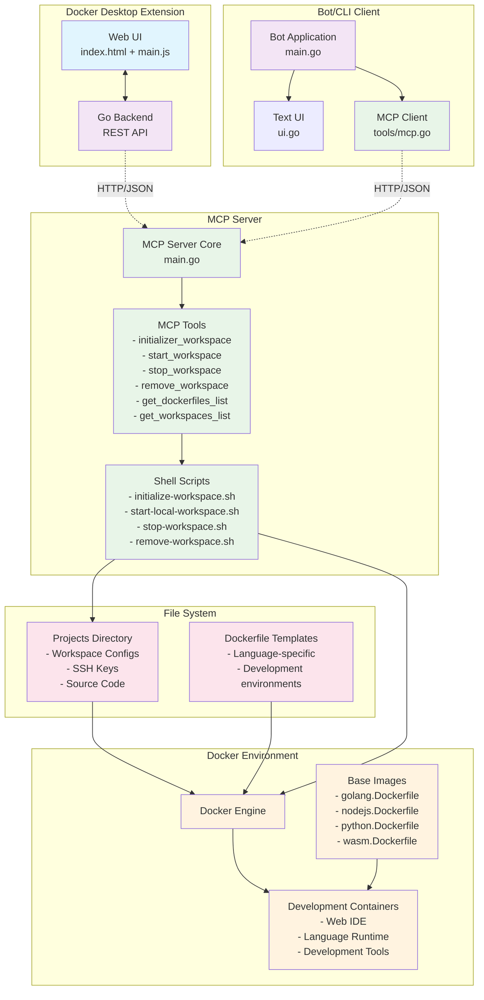

# Compose Codex

Spawn Web IDEs for Golang, NodeJS, ...
> - 🚧 work in progress
> - 🤓 it's a proof of concept

## Architecture

Compose Codex is a comprehensive system for managing containerized development workspaces, built on a modular architecture that leverages the Model Context Protocol (MCP) for seamless integration between components.

### Component Overview

#### 🐳 **Docker Desktop Extension**
- **Frontend (UI)**: Web-based interface built with HTML/JavaScript for workspace management
- **Backend**: Go REST API server that processes workspace operations and communicates with the MCP server
- **Features**: Workspace creation, status monitoring, build progress tracking, and lifecycle management

#### 🔧 **MCP Server (Core)**
- **Purpose**: Central orchestration layer that implements the Model Context Protocol
- **Location**: Root directory (`main.go`)
- **Tools Provided**:
  - `initializer_workspace`: Creates new development workspaces
  - `start_workspace`: Launches containerized environments  
  - `stop_workspace`: Stops running workspaces
  - `remove_workspace`: Cleans up workspace resources
  - `get_dockerfiles_list`: Lists available development templates
  - `get_workspaces_list`: Retrieves existing workspace information

#### 🤖 **Bot/CLI Client (Use Case)**
- **Purpose**: Command-line interface demonstrating MCP integration
- **Location**: `bot/` directory
- **Features**: Text-based UI for workspace management and MCP tool interaction
- **Use Case**: Shows how external applications can integrate with the MCP server

#### 🏗️ **Development Infrastructure**
- **Docker Engine**: Manages containerized development environments
- **Base Images**: Language-specific Dockerfiles (Go, Node.js, Python, WebAssembly)
- **Workspaces**: Isolated development environments with Web IDEs
- **Storage**: Project files, SSH keys, and configuration management

### Communication Flow

1. **User Interaction**: Users interact through either the Docker Desktop extension UI or the Bot CLI
2. **API Layer**: Frontend sends requests to the Go backend (Extension) or Bot processes commands (CLI)  
3. **MCP Protocol**: Backend components communicate with the MCP server using HTTP/JSON
4. **Tool Execution**: MCP server executes appropriate tools and shell scripts
5. **Docker Integration**: Scripts manage Docker containers, images, and workspace lifecycle
6. **File System**: Workspaces are persisted in the projects directory with proper configuration

This architecture enables modular development, easy integration of new clients, and centralized workspace management through the MCP protocol.

## Setup

### Start the MCP Server

1. git clone this repository: `git clone git@github.com:k33g/compose-codex.git`
2. cd into the cloned repository: `cd compose-codex`
3. start the mcp server: `start.mcp.server.sh`

### Build and install the Docker Desktop extension

1. `cd compose-codex/docker/compose-codex`
2. Build the extension: `make build-extension`
3. Install the extension: `make install-extension`

## Usage

### Initialize a workspace with the Docker Desktop extension

Open Docker Desktop and select the "Compose Codex" extension.

Select the **"Workspace Config"** panel:

Fill in the form with the following variables:
- **SSH Key Name**: the name of the ssh key you want to use (without the `.pub` extension)
  - > ✋ To get the list of the ssh keys available on your machine: `ls $HOME/.ssh/*` and use only the prefix of the file name (not the `.pub` extension)
- **Git User Email**: your email
- **Git User Name**: your github handle
- **Git Host**: the git provider (not yet tested with gitlab.com) *(you cannot change this value)*
- **Repository**: the repository you want to clone
- **Workspace Name**: the name of the workspace you want to create
- **Projects Directory**: the directory where the workspace will be created *(you cannot change this value)*
- **Dockerfile Name**: the name of the Dockerfile to use *(this is a dropdown list of the Dockerfiles available in the repository)*
- **Compose File Name**: the name of the compose file to use *(you cannot change this value)*
- **Offload Override Name**: the name of the offload override file to use *(you cannot change this value)*
- **HTTP Port**: the port to use for the web IDE

Then click on the **"Initialize Workspace"** button:

A project will be created in the `projects` directory with the name of the workspace you provided, and the Dockerfile and compose file will be copied into it.

### Start a workspace with the Docker Desktop extension

Go to **"Workspaces List"** panel and select the workspace you want to start:

Click on **"Start Workspace"** button:
> **Take a coffee ☕️ for the first build.**

The workspace will be started and you will be able to access it via the web IDE.

✋ You can use this URL [http://localhost:6670/?folder=/home/workspace/demo-go-agent](http://localhost:6670/?folder=/home/workspace/demo-go-agent) to access the web IDE, where `demo-go-agent` is the name of the project you cloned.

### Reach the web IDE from the Containers view of Docker Desktop

Go to the **Containers** view of Docker Desktop and select the container with the name of your workspace.

Click on the URL, the web IDE will open in your browser:

Click on the **"Open Folder"** button:

Select the directory of your project to open it in the web IDE:

You can now use the web IDE to edit your code, run commands, and use git.

### Stop a workspace

To stop a workspace, go to the **"Workspaces List"** panel, select the workspace you want to stop, and click on the **"Stop Workspace"** button: