# Compose Codex

Spawn Web IDEs for Golang, NodeJS, ...
> 🚧 work in progress

## Setup

### Start the MCP Server

1. git clone this repository: `git clone git@github.com:k33g/compose-codex.git`
2. cd into the cloned repository: `cd compose-codex`
3. start the mcp server: `start.mcp.server.sh`

### Build and install the Docker Desktop extension

1. `cd compose-codex/docker/compose-codex`
2. Build the extension: `make build-extension`
3. Install the extension: `make install-extension`

## Usage

### Initialize a workspace with the Docker Desktop extension

Open Docker Desktop and select the "Compose Codex" extension.

Select the **"Workspace Config"** panel:

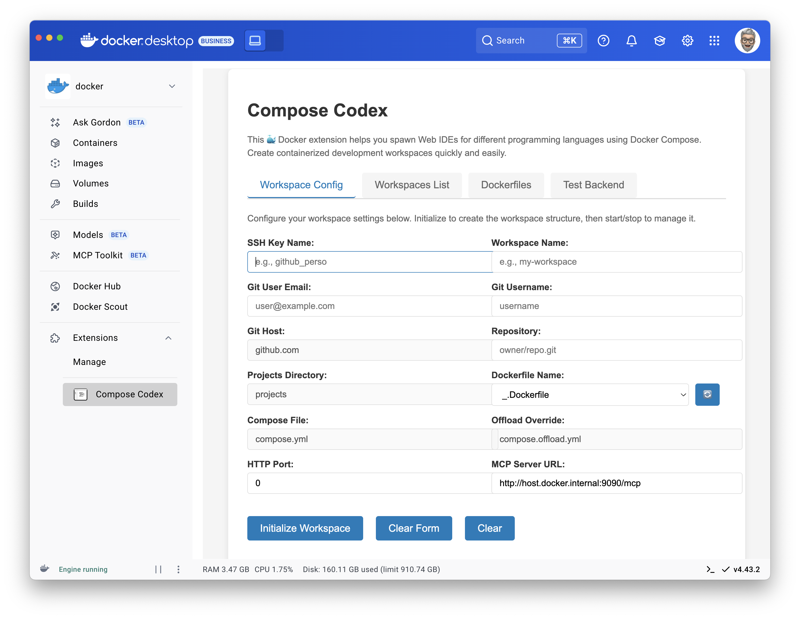

Fill in the form with the following variables:
- **SSH Key Name**: the name of the ssh key you want to use (without the `.pub` extension)
  - > ✋ To get the list of the ssh keys available on your machine: `ls $HOME/.ssh/*` and use only the prefix of the file name (not the `.pub` extension)
- **Git User Email**: your email
- **Git User Name**: your github handle
- **Git Host**: the git provider (not yet tested with gitlab.com) *(you cannot change this value)*
- **Repository**: the repository you want to clone
- **Workspace Name**: the name of the workspace you want to create
- **Projects Directory**: the directory where the workspace will be created *(you cannot change this value)*
- **Dockerfile Name**: the name of the Dockerfile to use *(this is a dropdown list of the Dockerfiles available in the repository)*
- **Compose File Name**: the name of the compose file to use *(you cannot change this value)*
- **Offload Override Name**: the name of the offload override file to use *(you cannot change this value)*
- **HTTP Port**: the port to use for the web IDE

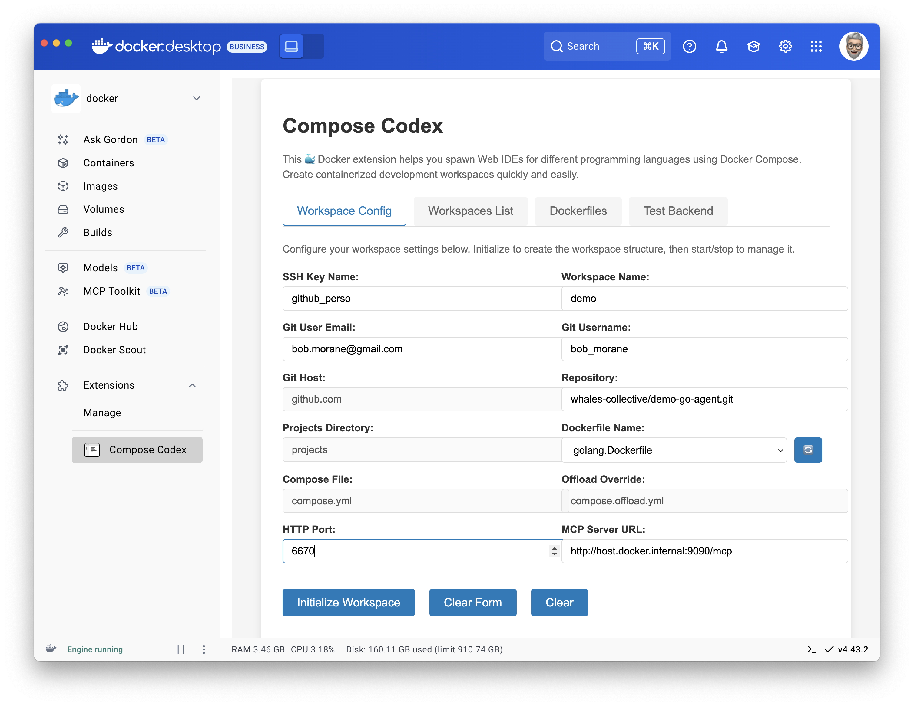

Then click on the **"Initialize Workspace"** button:

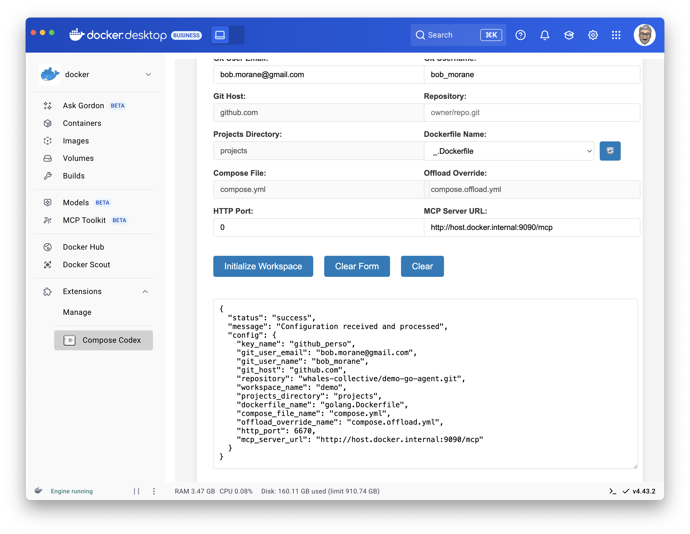

A project will be created in the `projects` directory with the name of the workspace you provided, and the Dockerfile and compose file will be copied into it.

### Start a workspace with the Docker Desktop extension

Go to **"Workspaces List"** panel and select the workspace you want to start:

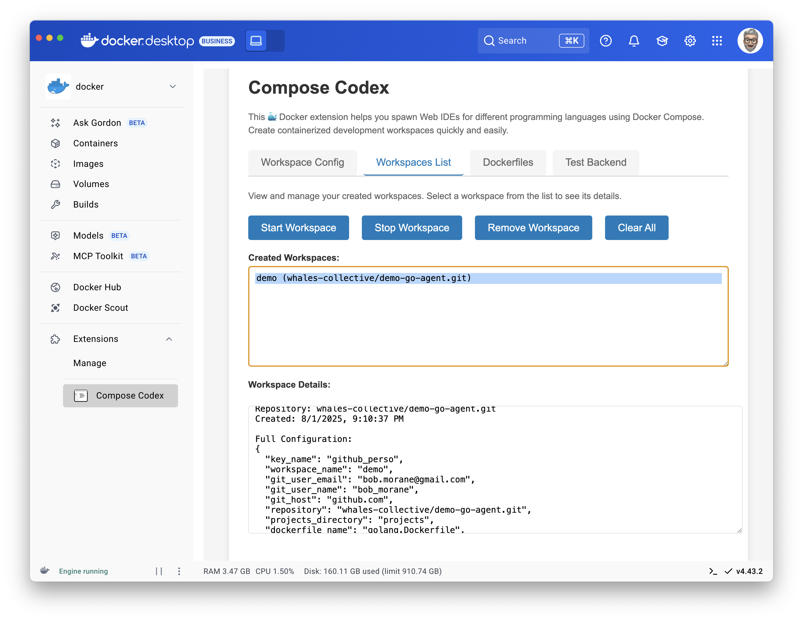

Click on **"Start Workspace"** button:
> **Take a coffee ☕️ for the first build.**

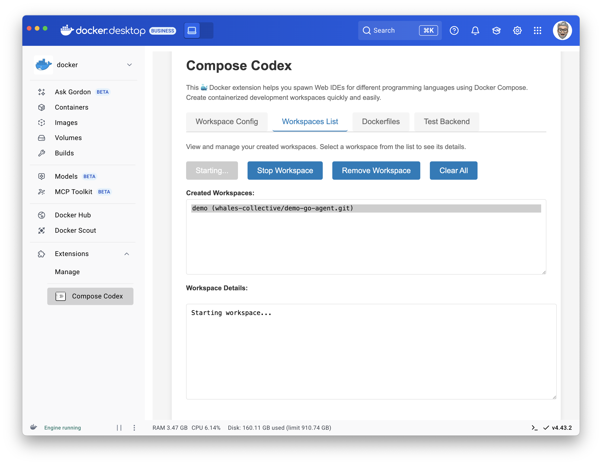

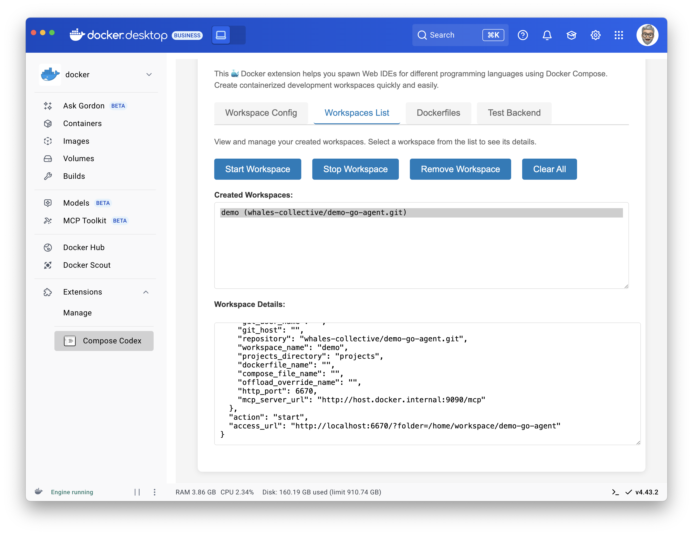

The workspace will be started and you will be able to access it via the web IDE.

✋ You can use this URL [http://localhost:6670/?folder=/home/workspace/demo-go-agent](http://localhost:6670/?folder=/home/workspace/demo-go-agent) to access the web IDE, where `demo-go-agent` is the name of the project you cloned.

### Reach the web IDE from the Containers view of Docker Desktop

Go to the **Containers** view of Docker Desktop and select the container with the name of your workspace.

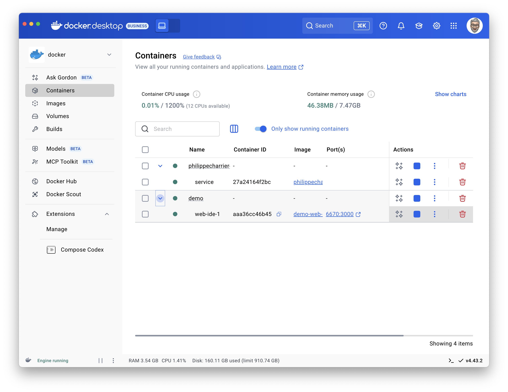

Click on the URL, the web IDE will open in your browser:

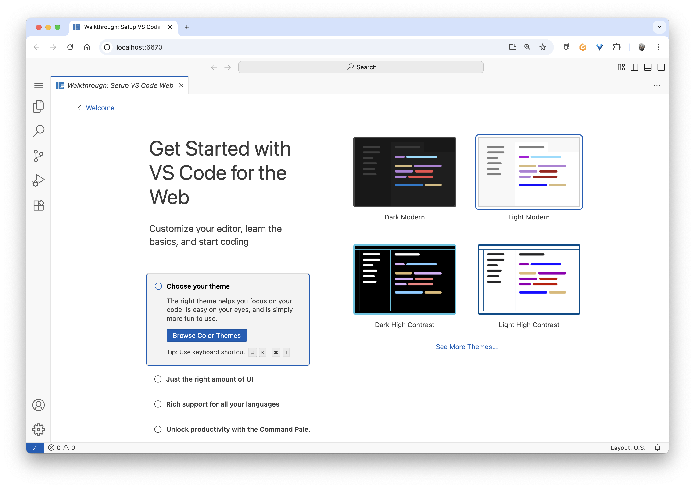

Click on the **"Open Folder"** button:
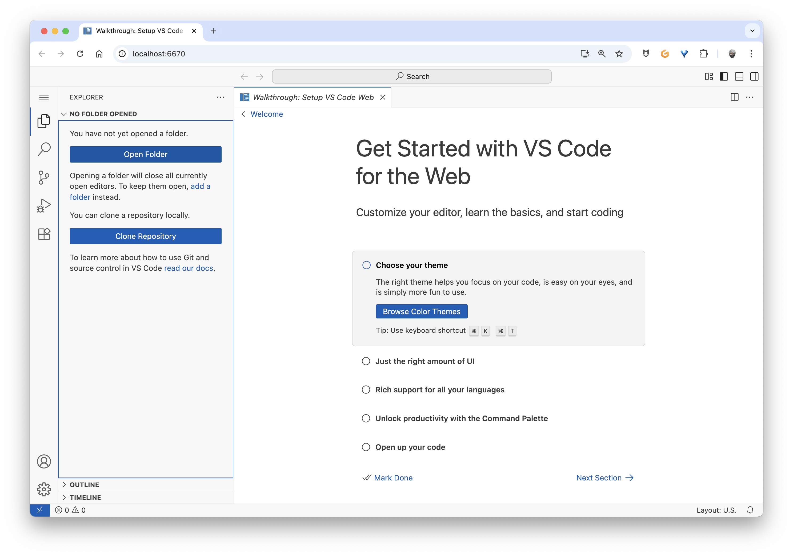

Select the directory of your project to open it in the web IDE:
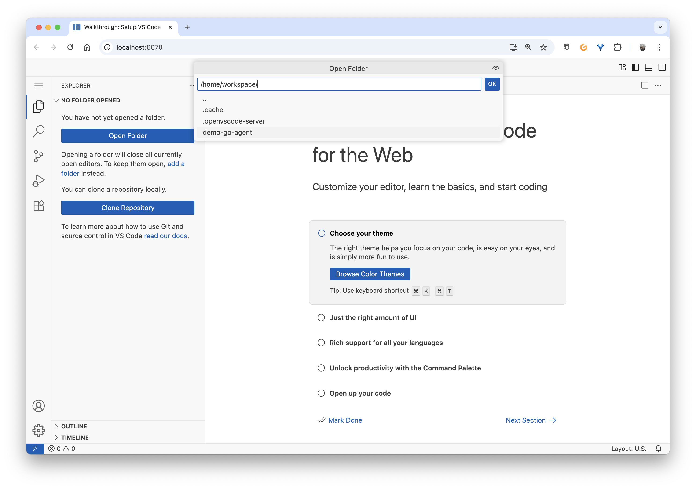

You can now use the web IDE to edit your code, run commands, and use git.
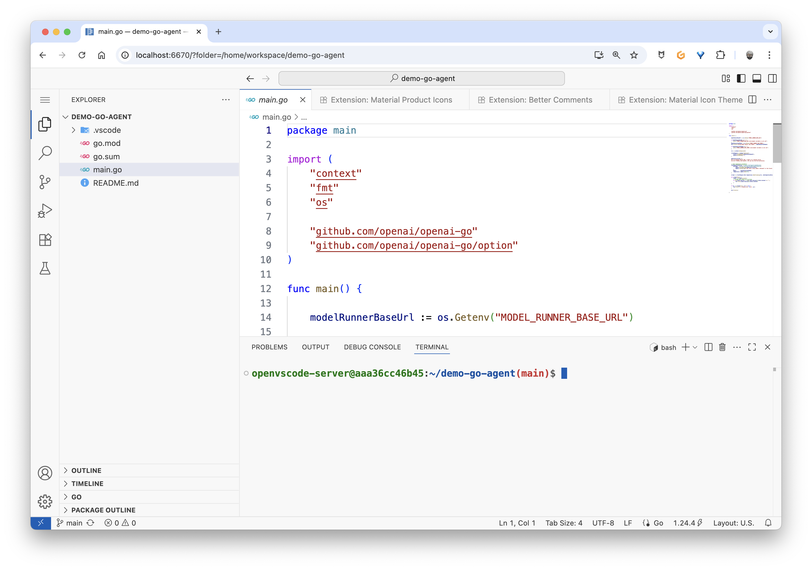

### Stop a workspace

To stop a workspace, go to the **"Workspaces List"** panel, select the workspace you want to stop, and click on the **"Stop Workspace"** button: